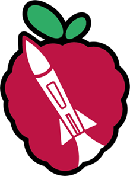

# BerryRocket example code for BR Micro-Avionic

  

## 🚀 Overview

This code is the simplest code embedded in rocket.
It acquires acceleration on Y axis and starts recording when >2g (time, acceleration Y, barometer, temperature).
The buzzer is used to indicate the state of the rocket (before flight, after take-off).

## Key Features

- **Sensor Compatibility**: Works with **BR Micro-Sensor** or **GY87-like sensor board**.
- **Data Logging**: Saves human-readable data in a text file.
- **Takeoff Detection**: Uses IMU (Inertial Measurement Unit) to detect takeoff.
- **Buzzer Feedback**: Provides audible feedback for rocket state.

## Educational Purpose

This project is designed as a **foundational tool** for both **classroom use** and **amateur developers** interested in rocketry and embedded systems. It is not a complete product, but a flexible starting point for:

- **Students**: Use as a sandbox for experimenting with programming, sensors, and data logging.
- **Amateur Developers**: Practice coding, modify features, and test new ideas in a low-stakes environment.

### Encouraged Activities:
- **Experiment**: Modify the code to add new features or improve existing ones.
- **Learn**: Understand programming concepts through hands-on practice.
- **Collaborate**: Share your changes and insights with others to foster collective learning.

It provides a basic framework that can be expanded upon, encouraging experimentation, learning, and further development about rocketry avionic.
Both students and amateurs can grow their understanding of programming concepts while gaining practical experience through experimentation.